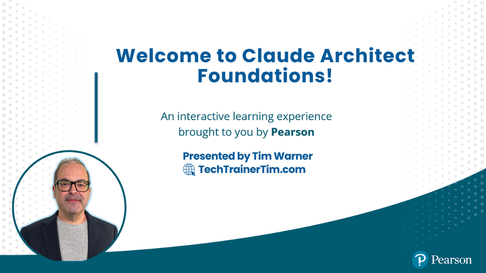

# Claude Architect Foundations - O'Reilly Live Training

[](https://techtrainertim.com)
[](https://www.linkedin.com/in/timothywarner/)
[](https://github.com/timothywarner-org)
[](https://learning.oreilly.com/search/?query=Tim%20Warner)
[](https://www.youtube.com/c/TechTrainerTim)
[](https://mvp.microsoft.com/en-us/PublicProfile/5004754)
[](LICENSE)

**Contact:** [Website](https://techtrainertim.com) | [LinkedIn](https://www.linkedin.com/in/timothywarner/) | [GitHub](https://github.com/timothywarner-org) | [O'Reilly](https://learning.oreilly.com/search/?query=Tim%20Warner) | [YouTube](https://www.youtube.com/c/TechTrainerTim)

---

Reference architectures, code examples, and practice scenarios for the **Claude Architect** role. This 4-hour O'Reilly Media live training is **skills-first** for Segments 1-3, then closes with a **CCA-F certification capstone** in Segment 4 (cert briefing + weighted practice questions). It teaches the production patterns that define a Claude Architect (agentic orchestration, tool design with MCP, Claude Code workflows, prompt engineering, context management) and gives you a runway to Anthropic's CCA-F exam.

> Anthropic's **Claude Certified Architect: Foundations (CCA-F)** exam is currently restricted to Anthropic partners. The five reference files in this repo map to the published 5-domain exam blueprint, and [`CERT-PROGRAM-BRIEFING.md`](./CERT-PROGRAM-BRIEFING.md) walks through exam mechanics, prep stack, and a week-before punchlist.

> **New: [`EXAM-STUDY-PATH.md`](./EXAM-STUDY-PATH.md)** is the learner-facing bridge from this workshop's notebooks to CCA-F domains and scenario families. Read it after the course-at-a-glance table below if you are aiming at the exam.

## What is a Claude Architect?

The Claude Architect is an emerging job role focused on designing and building production-grade applications with **Claude Code**, the **Claude Agent SDK**, the **Claude API**, and **Model Context Protocol (MCP)**. Organizations across the Claude Partner Network are hiring for this skillset.

## Course at a glance

| Segment | Duration | Topic | Key deliverable |
|---|---|---|---|
| 1 | 50 min | Building AI Agents That Use Tools | Customer support agent with hook-enforced policy |
| 2 | 50 min | Tool Design, Integration, and Claude Code Workflows | MCP config walkthrough + Claude Code hierarchy demo |
| **2.5** | *self-study* | **Control Surfaces, Tool Enumeration, Console Assets** | **All `tool_choice` modes live, `stop_sequences` / `max_tokens` / `pause_turn`, MCP `list_tools`, and the live Claude Console asset surface (`memory_stores`, `vaults`, `agents`, `sessions`). Q&A overflow / cohort homework, not on the 4-hour clock.** |
| 3 | 50 min | Structured Output, Context, and Production Reliability | Invoice extractor with retry + triage scorecard |
| 4 | 50 min | CCA-F Certification Capstone | Cert briefing + 10 weighted practice questions + take-home punchlist |

Total live class time: 4 hours (4 × 50-min segments + 3 × 10-min breaks). Segment 2.5 is a deep-dive notebook taught only as Q&A overflow or post-class homework. Instructors and learners should start at **[COURSE-FLOW.md](./COURSE-FLOW.md)**.

## CCA-F exam blueprint (the five core competencies)

| Domain | Weight | Reference file | Focus |
|---|---|---|---|
| 1 - Agentic Architecture & Orchestration | **27%** | [domain-1-agentic.md](./domain-1-agentic.md) | Agentic loops, multi-agent coordination, hooks, session management |
| 2 - Tool Design & MCP Integration | 18% | [domain-2-tools-mcp.md](./domain-2-tools-mcp.md) | Tool descriptions, structured errors, scoped distribution, MCP config |
| 3 - Claude Code Configuration & Workflows | 20% | [domain-3-claude-code.md](./domain-3-claude-code.md) | CLAUDE.md hierarchy, skills, slash commands, plan mode, CI/CD |
| 4 - Prompt Engineering & Structured Output | 20% | [domain-4-prompts.md](./domain-4-prompts.md) | Explicit criteria, few-shot prompting, JSON schemas via tool use, batch API |
| 5 - Context Management & Reliability | 15% | [domain-5-context.md](./domain-5-context.md) | Context preservation, escalation, error propagation, provenance |

**Exam mechanics:** 60 multiple-choice questions, 120 minutes, scaled 100-1000 with **720 passing**, proctored via ProctorFree, **one attempt only**, $99 (partner discount available). See [`CERT-PROGRAM-BRIEFING.md`](./CERT-PROGRAM-BRIEFING.md) for the full briefing.

## Repository layout

```text
claude-architect/
├── INSTRUCTOR-SETUP.md         # Multi-day setup arc (machine config, env vars, repo clone, backup plans)
├── COURSE-FLOW.md              # Master instructor punchlist (4 segments × 50 min)
├── PRE-CLASS-CHECKLIST.md      # Instructor pre-flight (PowerShell)
├── CERT-PROGRAM-BRIEFING.md    # Segment 4 talk-track: exam mechanics, domain weights, week-before punchlist
├── PRACTICE-QUESTIONS.md       # 60-question practice bank, hand-maintained (cohort take-home)
├── practice-questions.json     # Machine-readable practice-question source
├── domain-1-agentic.md         # Reference: Agentic Architecture & Orchestration
├── domain-2-tools-mcp.md       # Reference: Tool Design & MCP Integration
├── domain-3-claude-code.md     # Reference: Claude Code Configuration & Workflows
├── domain-4-prompts.md         # Reference: Prompt Engineering & Structured Output
├── domain-5-context.md         # Reference: Context Management & Reliability
├── .mcp.json                   # Segment 2 Demo A anchor (5 servers, 3 transports)
├── .vscode/mcp.json            # VS Code / GitHub Copilot agent-mode MCP config (sibling schema to .mcp.json)
├── hooks-example.py            # Agent SDK hooks: compliance enforcement
├── coordinator-subagent-sketch.py  # Domain 1 coordinator-subagent scaffold (read-only reference)
├── scenario-cicd-integration.md # Codebase analysis skill with frontmatter
├── SKILL.md                    # Example slash-command / skill definition
├── CLAUDE.md                   # Claude Code project instructions for this repo
├── notebooks/                  # Tim's six teaching notebooks (five live + one self-study deep dive)
│   ├── segment-0-pre-flight.ipynb
│   ├── segment-1-customer-support-agent.ipynb
│   ├── segment-2-tool-design-and-mcp.ipynb
│   ├── segment-2-5-control-surfaces.ipynb     # self-study; control surfaces + Console assets
│   ├── segment-3-invoice-extractor.ipynb
│   └── segment-4-cca-f-capstone.ipynb
├── claude-cookbooks-main/      # Vendored snapshot of Anthropic's official Claude Cookbooks (MIT, Copyright (c) 2023 Anthropic). See claude-cookbooks-main/NOTICE.md
├── examples/                   # Curated reference applications (study material, not core course)
│   └── mcp_cli/                # Reference MCP CLI (FastMCP server + client + chat), from Anthropic's Skilljar course. See examples/mcp_cli/NOTICE.md
├── slides/                     # Course slide deck (rebuilt from scripts/build-deck.py)
└── scripts/
    ├── build-notebooks.py                 # Rebuilds the six teaching notebooks from source (sha256-deterministic, idempotent)
    ├── run-jupyter.ps1                    # Lifecycle helper: starts JupyterLab on port 8888 with Jupyter AI v3 persona override
    ├── stop-jupyter.ps1                   # Lifecycle helper: port-scoped clean shutdown with PID fallback for Windows half-states
    ├── voice-lint.ps1                     # Voice-lint sweep (no em dashes, no AWS, etc.) - run via `npm run lint:voice`
    ├── preflight.ps1                      # Instructor pre-flight - run via `npm run preflight`
    ├── build-deck.py                      # Rebuilds the slide deck
    └── extract-practice-questions.py      # RETIRED extractor (practice-question files are now hand-maintained)
```

## Getting started

### Prerequisites

- [**Python**](https://www.python.org/) 3.13+ (every notebook and demo in this course runs against the Python [`anthropic`](https://pypi.org/project/anthropic/) SDK, pinned `>=0.40,<1.0` in [`notebooks/pyproject.toml`](./notebooks/pyproject.toml))
- [**uv**](https://docs.astral.sh/uv/) (the Python package manager): `pip install uv` or `winget install astral-sh.uv`
- [Claude Code CLI](https://docs.claude.com/en/docs/claude-code) installed and authenticated. On Windows the native installer is the fastest path: `irm https://claude.ai/install.ps1 | iex`
- An [Anthropic API key](https://console.anthropic.com/) set as `ANTHROPIC_API_KEY` (PowerShell: `$env:ANTHROPIC_API_KEY = "sk-ant-..."`, or place it in a gitignored `.env` at repo root)
- **VS Code** with the **Python** and **Jupyter** extensions (the six teaching notebooks open here)
- Optional, instructors only: [Node.js](https://nodejs.org/) 18+ for the two npm scripts ([`npm run lint:voice`](./scripts/voice-lint.ps1), [`npm run preflight`](./scripts/preflight.ps1)). Learners can skip Node entirely.

### Setup (on-rails, one command)

```powershell
git clone https://github.com/timothywarner-org/claude-architect.git
cd claude-architect
uv run --project notebooks jupyter lab notebooks/
```

That is the entire learner setup. **First run** auto-creates `notebooks/.venv/`, installs all dependencies from `notebooks/pyproject.toml`, and launches Jupyter. **Subsequent runs** reuse the venv and start in seconds. The Anthropic cookbook ships in the repo at `claude-cookbooks-main/`, so you do not need a second clone. Instructors who run the voice-lint scripts also need `npm install`; learners do not.

**Fallback** if `uv` is not available: `pip install -r notebooks/requirements.txt` still works; the requirements file is kept in sync with `pyproject.toml`.

**Interactive teaching sessions** should use the lifecycle helpers instead of a bare Jupyter invocation:

```powershell
.\scripts\run-jupyter.ps1            # default port 8888, overrides Jupyter AI default persona to Jupyternaut
.\scripts\stop-jupyter.ps1           # port-scoped clean shutdown with PID fallback
```

`run-jupyter.ps1` sets the Jupyter AI v3 default persona to Jupyternaut so chat messages route to someone (the upstream default points at the older package ID and silently routes to nobody). `stop-jupyter.ps1` matches the server by `root_dir`, falls back to `Stop-Process` on the exact PID if the graceful path hangs (Jupyter AI can leave the server half-interrupted on Windows). For headless smoke runs (`nbconvert --execute`) neither script is needed - nbconvert spawns its own kernel.

### Run the MCP CLI reference app (also one command)

The vendored [`examples/mcp_cli/`](./examples/mcp_cli/) Skilljar reference app gets the same on-rails treatment via a wrapper that auto-bootstraps its `.env` and hands off to `uv`:

```powershell
.\scripts\run-mcp-cli.ps1
```

First run creates `examples/mcp_cli/.env` from the template, lifts `ANTHROPIC_API_KEY` from your repo-root `.env`, and then runs `uv run --directory examples/mcp_cli main.py`. Subsequent runs go straight to the REPL. The wrapper sits in [`scripts/run-mcp-cli.ps1`](./scripts/run-mcp-cli.ps1) and never touches the vendored `examples/mcp_cli/` tree, preserving the NOTICE.md modification count at 2.

### Recommended learning path

1. **Read [COURSE-FLOW.md](./COURSE-FLOW.md)** for the full 4-segment teaching arc.
2. **Walk the five `domain-*.md` reference files** in order. Each maps to a course segment and points at runnable cookbook notebooks.
3. **Run the five live-teaching notebooks in [`notebooks/`](./notebooks/)** in order, plus the [`segment-2-5-control-surfaces.ipynb`](./notebooks/segment-2-5-control-surfaces.ipynb) self-study deep dive when time allows. These are the primary teaching surface - markdown cells carry the concepts, code cells run the demos. Anthropic's official cookbooks ship alongside in [`claude-cookbooks-main/`](./claude-cookbooks-main/) as the bundled-in reference library (full attribution in [`claude-cookbooks-main/NOTICE.md`](./claude-cookbooks-main/NOTICE.md)).
4. **Work through [`CERT-PROGRAM-BRIEFING.md`](./CERT-PROGRAM-BRIEFING.md)** and the [`PRACTICE-QUESTIONS.md`](./PRACTICE-QUESTIONS.md) bank if you're aiming at the CCA-F exam.
5. **Build something.** The reference architectures only land when you wire one of these patterns into a real workflow.

## Practice scenarios (CCA-F exam pool)

Each scenario frames a realistic production context that a Claude Architect would encounter. The CCA-F exam draws **4 scenarios at random from a pool of 6**:

| # | Scenario | Primary competencies |
|---|---|---|
| 1 | Customer Support Resolution Agent | Domains 1, 2, 5 |
| 2 | Code Generation with Claude Code | Domains 3, 5 |
| 3 | Multi-Agent Research System | Domains 1, 2, 5 |
| 4 | Developer Productivity Tooling | Domains 1, 2, 3 |
| 5 | CI/CD Integration with Claude Code | Domains 3, 4 |
| 6 | Structured Data Extraction Pipeline | Domains 4, 5 |

## Key concepts quick reference

### Agentic loop

```text
Send request -> Check stop_reason -> "tool_use"? Execute tool, append tool_result, loop
                                  -> "end_turn"? Done
                                  -> "pause_turn"? Resume in next request
```

### Tool selection

- **Descriptions drive selection.** Detailed descriptions beat clever tool names.
- **Cap at 4-5 tools per agent.** More tools degrade selection accuracy.
- **Structured errors as tool_result content.** Never raise exceptions from tool implementations.

### `tool_choice` modes (Segment 2.5)

| Mode | Forces what? | When to pick |
|---|---|---|
| `{"type": "auto"}` | nothing | default |
| `{"type": "any"}` | a tool call (model picks which) | action required, model picks verb |
| `{"type": "tool", "name": "X"}` | call to tool X | forced structured output (Segment 3) |
| `{"type": "none"}` | no tool calls | "explain, don't act" turns |
| add `disable_parallel_tool_use: true` | one tool per turn | ordering matters (write-then-read, lookup-then-act) |

### Stop conditions (Segment 2.5)

Branch on `stop_reason`, never parse prose to decide control flow. Six values: `end_turn`, `tool_use`, `max_tokens`, `stop_sequence`, `pause_turn`, `refusal`. `stop_sequences` gives you a deterministic cutoff token (matched value comes back in `resp.stop_sequence`, the token itself is excluded from the output). `max_tokens` doubles as a deliberate cutoff lever: set it low, replay the partial assistant turn in the next call to resume.

### Tool enumeration, four lenses (Segment 2.5)

1. **Static** - iterate the `tools=[...]` array you registered
2. **Runtime loop** - log scoped tools + `tool_choice` per iteration
3. **MCP `list_tools`** - the pattern that scales beyond hand-registered tools
4. **Claude Code harness** - separate surface from API `tool_use`, discovered via `/help` and `~/.claude/`

### Claude Console asset surface (Segment 2.5)

All reachable from the SDK with `anthropic-beta: managed-agents-2026-04-01`:

- `client.beta.memory_stores` - persistence that survives restarts (Domain 5)
- `client.beta.vaults` (+ `.credentials.mcp_oauth_validate`) - secrets hygiene with MCP OAuth (Domain 3)
- `client.beta.agents` + `client.beta.sessions` - the managed-loop alternative to a hand-rolled agentic loop (Domain 1)

### Claude Code configuration

- **User-level** `~/.claude/CLAUDE.md` for personal defaults
- **Project-level** `./CLAUDE.md` at repo root for team conventions
- **Subtree** `<subdir>/CLAUDE.md` loads on demand
- **`claude -p`** for headless / CI/CD usage

### Structured output

- **`tool_use` with JSON schema = guaranteed schema compliance.** Define output as a tool's `input_schema`, force the model to call it with `tool_choice: {"type": "tool", "name": "..."}`.
- **Few-shot examples > temperature.** Two or three input-output pairs beat tuning sampling parameters.

### Prompt caching floors (gotcha)

`cache_control` silently no-ops if the cacheable prefix is below the model's floor. **Sonnet 4.x: 1024 tokens. Haiku 4.5: 4096 tokens (4x higher).** A cell can exit clean with `cache_creation=0` and `cache_read=0` if the prefix sits between the two floors; the smoke output, not the exit code, is what tells you caching engaged. Target +25% above the floor for safety margin against tokenizer drift.

### Model policy

- **Haiku 4.5 default everywhere.** Production-quality tool use, agentic loops, and MCP discovery at ~1/5 the Sonnet cost.
- **Sonnet 4.6 reserved** for one demo: Segment 3's nested invoice schemas with retry-on-validation-error.
- **Opus never used** in code in this repo. Console-managed agents carry their own configured model field (Deep Researcher resolves to Sonnet 4.6); the SDK respects what the Console sets.

### Context and reliability

- Pin case-facts at the top of long sessions
- Summarize resolved turns; keep verbatim history only for the active issue
- Escalate on explicit human request, policy gaps, or low confidence - never on sentiment alone

## About the instructor

**Tim Warner** is a Microsoft MVP (Azure AI), Pluralsight Principal Author (200+ courses, 1M+ learners), Microsoft Press / Pearson senior content developer, and O'Reilly Live Learning instructor with 28+ years on the Microsoft stack. He teaches Feynman-style: first principles, no fluff, real demos.

- Website: [TechTrainerTim.com](https://techtrainertim.com)
- LinkedIn: [@timothywarner](https://www.linkedin.com/in/timothywarner/)
- GitHub: [@timothywarner-org](https://github.com/timothywarner-org)
- YouTube: [TechTrainerTim](https://www.youtube.com/c/TechTrainerTim)
- O'Reilly: [Author page](https://learning.oreilly.com/search/?query=Tim%20Warner)

## Attribution and licensing

This repo bundles three distinct bodies of work. The split matters for attribution and for reuse:

- **Original content by Tim Warner.** Everything in [`notebooks/`](./notebooks/), the five [`domain-*.md`](./domain-1-agentic.md) reference files, [`COURSE-FLOW.md`](./COURSE-FLOW.md), [`CERT-PROGRAM-BRIEFING.md`](./CERT-PROGRAM-BRIEFING.md), [`PRE-CLASS-CHECKLIST.md`](./PRE-CLASS-CHECKLIST.md), [`INSTRUCTOR-SETUP.md`](./INSTRUCTOR-SETUP.md), [`CLAUDE.md`](./CLAUDE.md), and everything under [`scripts/`](./scripts/) is authored by Tim Warner and licensed under MIT via this repo's [`LICENSE`](./LICENSE) file.
- **Vendored Anthropic content.** [`claude-cookbooks-main/`](./claude-cookbooks-main/) is a vendored copy of Anthropic's official [Claude Cookbooks](https://github.com/anthropics/claude-cookbooks), MIT licensed, **Copyright (c) 2023 Anthropic**. Full attribution, upstream commit reference, and the unmodified MIT license live in [`claude-cookbooks-main/NOTICE.md`](./claude-cookbooks-main/NOTICE.md) and [`claude-cookbooks-main/LICENSE`](./claude-cookbooks-main/LICENSE). It is committed here so learners get the entire reference library on `git clone` without a second clone step.
- **Reference application from Anthropic's Skilljar course.** [`examples/mcp_cli/`](./examples/mcp_cli/) is a complete MCP CLI application (stdio FastMCP server + client + interactive chat with `@doc-id` retrieval and `/prompt-name` commands) distributed as starter material with Anthropic's [Claude with the Anthropic API](https://anthropic.skilljar.com/claude-with-the-anthropic-api/) Skilljar course. Treated as Anthropic-authored instructional reference; full attribution and the two minor modifications (rename `.env` to `.env.example`, add `NOTICE.md`) are documented in [`examples/mcp_cli/NOTICE.md`](./examples/mcp_cli/NOTICE.md). Segment 2 of the course opens its `mcp_server.py` source during Demo A.
- **Practice bank with split provenance.** In [`PRACTICE-QUESTIONS.md`](./PRACTICE-QUESTIONS.md) the question stems, options, and correct answers are community-sourced from Paul Larionov's study repo; the answer explanations are this repo's own work, grounded in Anthropic documentation. The file is hand-maintained (see the [Disclaimer](#disclaimer) below for the full provenance and calibration-only framing).
- **Point-in-time snapshots, not submodules.** Both [`claude-cookbooks-main/`](./claude-cookbooks-main/) and [`examples/mcp_cli/`](./examples/mcp_cli/) are static snapshots, not git submodules. Refresh procedures are documented in each directory's `NOTICE.md`.

## Disclaimer

This is an **unofficial study guide** built around Anthropic's publicly documented CCA-F exam blueprint. Practice questions in [`PRACTICE-QUESTIONS.md`](./PRACTICE-QUESTIONS.md) are community-sourced from [Paul Larionov's study repo](https://github.com/paullarionov/claude-certified-architect) and are intended for **calibration only**, not as exam predictors. The authoritative source for exam content, registration, and policy is **Anthropic** (see the [public CCA-F page](https://anthropic.skilljar.com/) and the Exam Policy). Use Anthropic's own Practice Exam to gauge readiness before scheduling.

## Contributing

Contributions are welcome. See [CONTRIBUTING.md](CONTRIBUTING.md) for guidelines.

## License

MIT - see [LICENSE](LICENSE).

---

*Found this useful? Open an issue with questions or feedback - I read every one.*
